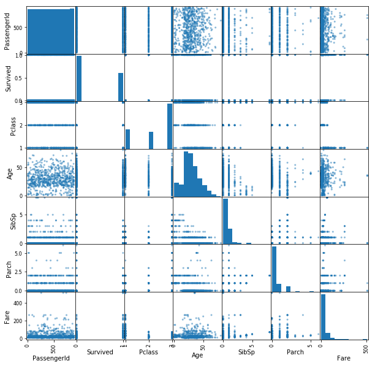
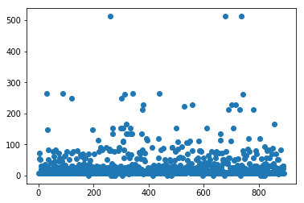

## Exploratory Data Analysis
Typically, whenever we are handed a new dataset or problem our first step is to begin to wrap our head around the problem and the data associated with it. This is where some of our previous tools such as the measure of center and dispersion will come in handy. From there, we can continue to dissect the problem by employing various techniques and algorithms to further analyze the dataset from various angles.  
  
  Here we'll investigate a classic dataset concerning the Titanic.

#### First let's import the dataset, see how long it is and preview the first 5 rows


```python
import pandas as pd
```


```python
df = pd.read_csv('train.csv')
print(len(df))
df.head()
```

    891


<div>
<style scoped>
    .dataframe tbody tr th:only-of-type {
        vertical-align: middle;
    }

    .dataframe tbody tr th {
        vertical-align: top;
    }

    .dataframe thead th {
        text-align: right;
    }
</style>
<table border="1" class="dataframe">
  <thead>
    <tr style="text-align: right;">
      <th></th>
      <th>PassengerId</th>
      <th>Survived</th>
      <th>Pclass</th>
      <th>Name</th>
      <th>Sex</th>
      <th>Age</th>
      <th>SibSp</th>
      <th>Parch</th>
      <th>Ticket</th>
      <th>Fare</th>
      <th>Cabin</th>
      <th>Embarked</th>
    </tr>
  </thead>
  <tbody>
    <tr>
      <th>0</th>
      <td>1</td>
      <td>0</td>
      <td>3</td>
      <td>Braund, Mr. Owen Harris</td>
      <td>male</td>
      <td>22.0</td>
      <td>1</td>
      <td>0</td>
      <td>A/5 21171</td>
      <td>7.2500</td>
      <td>NaN</td>
      <td>S</td>
    </tr>
    <tr>
      <th>1</th>
      <td>2</td>
      <td>1</td>
      <td>1</td>
      <td>Cumings, Mrs. John Bradley (Florence Briggs Th...</td>
      <td>female</td>
      <td>38.0</td>
      <td>1</td>
      <td>0</td>
      <td>PC 17599</td>
      <td>71.2833</td>
      <td>C85</td>
      <td>C</td>
    </tr>
    <tr>
      <th>2</th>
      <td>3</td>
      <td>1</td>
      <td>3</td>
      <td>Heikkinen, Miss. Laina</td>
      <td>female</td>
      <td>26.0</td>
      <td>0</td>
      <td>0</td>
      <td>STON/O2. 3101282</td>
      <td>7.9250</td>
      <td>NaN</td>
      <td>S</td>
    </tr>
    <tr>
      <th>3</th>
      <td>4</td>
      <td>1</td>
      <td>1</td>
      <td>Futrelle, Mrs. Jacques Heath (Lily May Peel)</td>
      <td>female</td>
      <td>35.0</td>
      <td>1</td>
      <td>0</td>
      <td>113803</td>
      <td>53.1000</td>
      <td>C123</td>
      <td>S</td>
    </tr>
    <tr>
      <th>4</th>
      <td>5</td>
      <td>0</td>
      <td>3</td>
      <td>Allen, Mr. William Henry</td>
      <td>male</td>
      <td>35.0</td>
      <td>0</td>
      <td>0</td>
      <td>373450</td>
      <td>8.0500</td>
      <td>NaN</td>
      <td>S</td>
    </tr>
  </tbody>
</table>
</div>


#### Then let's quickly get some more info about each of our column features:


```python
df.info()
```

    <class 'pandas.core.frame.DataFrame'>
    RangeIndex: 891 entries, 0 to 890
    Data columns (total 12 columns):
    PassengerId    891 non-null int64
    Survived       891 non-null int64
    Pclass         891 non-null int64
    Name           891 non-null object
    Sex            891 non-null object
    Age            714 non-null float64
    SibSp          891 non-null int64
    Parch          891 non-null int64
    Ticket         891 non-null object
    Fare           891 non-null float64
    Cabin          204 non-null object
    Embarked       889 non-null object
    dtypes: float64(2), int64(5), object(5)
    memory usage: 83.6+ KB


#### We can also quickly visualize the data:
Along the diagonal are the distributions for each of our variables. Every other cell shows a correlation plot of one feature against another feature.


```python
%matplotlib inline
pd.plotting.scatter_matrix(df, figsize=(10,10))
```


    array([[<matplotlib.axes._subplots.AxesSubplot object at 0x11fe82860>,
            <matplotlib.axes._subplots.AxesSubplot object at 0x1201a8588>,
            <matplotlib.axes._subplots.AxesSubplot object at 0x1201cc5f8>,
            <matplotlib.axes._subplots.AxesSubplot object at 0x120257908>,
            <matplotlib.axes._subplots.AxesSubplot object at 0x12027ae48>,
            <matplotlib.axes._subplots.AxesSubplot object at 0x12027ae80>,
            <matplotlib.axes._subplots.AxesSubplot object at 0x1202d1ba8>],
           [<matplotlib.axes._subplots.AxesSubplot object at 0x120302278>,
            <matplotlib.axes._subplots.AxesSubplot object at 0x120328908>,
            <matplotlib.axes._subplots.AxesSubplot object at 0x120352f98>,
            <matplotlib.axes._subplots.AxesSubplot object at 0x120383668>,
            <matplotlib.axes._subplots.AxesSubplot object at 0x1203aacf8>,
            <matplotlib.axes._subplots.AxesSubplot object at 0x1203de3c8>,
            <matplotlib.axes._subplots.AxesSubplot object at 0x120406a58>],
           [<matplotlib.axes._subplots.AxesSubplot object at 0x11fe45400>,
            <matplotlib.axes._subplots.AxesSubplot object at 0x12045e550>,
            <matplotlib.axes._subplots.AxesSubplot object at 0x120485be0>,
            <matplotlib.axes._subplots.AxesSubplot object at 0x1204b92b0>,
            <matplotlib.axes._subplots.AxesSubplot object at 0x1204e0940>,
            <matplotlib.axes._subplots.AxesSubplot object at 0x12050afd0>,
            <matplotlib.axes._subplots.AxesSubplot object at 0x12053c6a0>],
           [<matplotlib.axes._subplots.AxesSubplot object at 0x120564d30>,
            <matplotlib.axes._subplots.AxesSubplot object at 0x120596400>,
            <matplotlib.axes._subplots.AxesSubplot object at 0x1205bda90>,
            <matplotlib.axes._subplots.AxesSubplot object at 0x1205f0160>,
            <matplotlib.axes._subplots.AxesSubplot object at 0x1206167f0>,
            <matplotlib.axes._subplots.AxesSubplot object at 0x12063fe80>,
            <matplotlib.axes._subplots.AxesSubplot object at 0x120671550>],
           [<matplotlib.axes._subplots.AxesSubplot object at 0x12069abe0>,
            <matplotlib.axes._subplots.AxesSubplot object at 0x1206ca2b0>,
            <matplotlib.axes._subplots.AxesSubplot object at 0x1206f3940>,
            <matplotlib.axes._subplots.AxesSubplot object at 0x12071cfd0>,
            <matplotlib.axes._subplots.AxesSubplot object at 0x12074b6a0>,
            <matplotlib.axes._subplots.AxesSubplot object at 0x120775d30>,
            <matplotlib.axes._subplots.AxesSubplot object at 0x1207a6400>],
           [<matplotlib.axes._subplots.AxesSubplot object at 0x1207cfa90>,
            <matplotlib.axes._subplots.AxesSubplot object at 0x120802160>,
            <matplotlib.axes._subplots.AxesSubplot object at 0x1208287f0>,
            <matplotlib.axes._subplots.AxesSubplot object at 0x120850e80>,
            <matplotlib.axes._subplots.AxesSubplot object at 0x120883550>,
            <matplotlib.axes._subplots.AxesSubplot object at 0x1208abbe0>,
            <matplotlib.axes._subplots.AxesSubplot object at 0x1208dd2b0>],
           [<matplotlib.axes._subplots.AxesSubplot object at 0x120905940>,
            <matplotlib.axes._subplots.AxesSubplot object at 0x12092ffd0>,
            <matplotlib.axes._subplots.AxesSubplot object at 0x1209616a0>,
            <matplotlib.axes._subplots.AxesSubplot object at 0x120986d30>,
            <matplotlib.axes._subplots.AxesSubplot object at 0x1209b9400>,
            <matplotlib.axes._subplots.AxesSubplot object at 0x1209e2a90>,
            <matplotlib.axes._subplots.AxesSubplot object at 0x120a12160>]],
          dtype=object)





### Correlation and $r^2$, the correlation coefficient
If we want to investigate any of these relationships in more detail, or want to produce scatter plots in general, we can simply create a scatter plot of two variable against each other and numpy's built in **corrcoef** method.


```python
import matplotlib.pyplot as plt
import numpy as np
```


```python
print('The correlation coefficient is:', np.corrcoef(df.PassengerId, df.Fare))
plt.scatter(df.PassengerId, df.Fare)
```

    The correlation coefficient is: [[1.         0.01265822]
     [0.01265822 1.        ]]


    <matplotlib.collections.PathCollection at 0x1215dae10>





## Interpolation
Later, when we want to apply various algorithms to our data in order to better understand the dataset, or predict values, we will need to deal with null values. For example, here's how we would fit a basic classification algorithm to try and predict whether or not an individual survived on the Titanic:


```python
from sklearn.linear_model import LogisticRegression
numerics = ['int16', 'int32', 'int64', 'float16', 'float32', 'float64']

logit = LogisticRegression()

X = df.drop('Survived', axis=1).select_dtypes(include=numerics)
y = df['Survived']
logit.fit(X, y)
```


    ---------------------------------------------------------------------------

    ValueError                                Traceback (most recent call last)

    <ipython-input-25-008c98fbbb81> in <module>()
          6 X = df.drop('Survived', axis=1).select_dtypes(include=numerics)
          7 y = df['Survived']
    ----> 8 logit.fit(X, y)
    

    ~/anaconda3/lib/python3.6/site-packages/sklearn/linear_model/logistic.py in fit(self, X, y, sample_weight)
       1214 
       1215         X, y = check_X_y(X, y, accept_sparse='csr', dtype=_dtype,
    -> 1216                          order="C")
       1217         check_classification_targets(y)
       1218         self.classes_ = np.unique(y)


    ~/anaconda3/lib/python3.6/site-packages/sklearn/utils/validation.py in check_X_y(X, y, accept_sparse, dtype, order, copy, force_all_finite, ensure_2d, allow_nd, multi_output, ensure_min_samples, ensure_min_features, y_numeric, warn_on_dtype, estimator)
        571     X = check_array(X, accept_sparse, dtype, order, copy, force_all_finite,
        572                     ensure_2d, allow_nd, ensure_min_samples,
    --> 573                     ensure_min_features, warn_on_dtype, estimator)
        574     if multi_output:
        575         y = check_array(y, 'csr', force_all_finite=True, ensure_2d=False,


    ~/anaconda3/lib/python3.6/site-packages/sklearn/utils/validation.py in check_array(array, accept_sparse, dtype, order, copy, force_all_finite, ensure_2d, allow_nd, ensure_min_samples, ensure_min_features, warn_on_dtype, estimator)
        451                              % (array.ndim, estimator_name))
        452         if force_all_finite:
    --> 453             _assert_all_finite(array)
        454 
        455     shape_repr = _shape_repr(array.shape)


    ~/anaconda3/lib/python3.6/site-packages/sklearn/utils/validation.py in _assert_all_finite(X)
         42             and not np.isfinite(X).all()):
         43         raise ValueError("Input contains NaN, infinity"
    ---> 44                          " or a value too large for %r." % X.dtype)
         45 
         46 


    ValueError: Input contains NaN, infinity or a value too large for dtype('float64').


There's a lot going on there but let's begin with the error message:  
**"Input contains NaN, infinity or a value too large for dtype('float64')".**  
We've received this message because there are null (blank) values.  
So what are we to do?  
  
  One option is to simply fill all the null values with zero, or some other default value. We could also fill null values with the median, mean or another measure of center. Keep in mind however, that doing so will also reduce the variance of our dataset as we are synthetically adding data to the center of the distribution.


```python
#Preview which columns have null values
df.info()
```

    <class 'pandas.core.frame.DataFrame'>
    RangeIndex: 891 entries, 0 to 890
    Data columns (total 12 columns):
    PassengerId    891 non-null int64
    Survived       891 non-null int64
    Pclass         891 non-null int64
    Name           891 non-null object
    Sex            891 non-null object
    Age            714 non-null float64
    SibSp          891 non-null int64
    Parch          891 non-null int64
    Ticket         891 non-null object
    Fare           891 non-null float64
    Cabin          204 non-null object
    Embarked       889 non-null object
    dtypes: float64(2), int64(5), object(5)
    memory usage: 83.6+ KB


```python
#Fill null Values with zero or a static value
#df = df.fillna(value=0) #Don't run this; we'll try a more dynamic approach below
```


```python
## Fill all the null ages with the mean age
```


```python
#Fill null values in a column with column mean
df['Age'] = #Your code here
```
